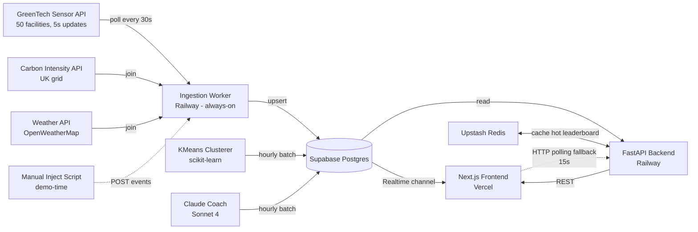
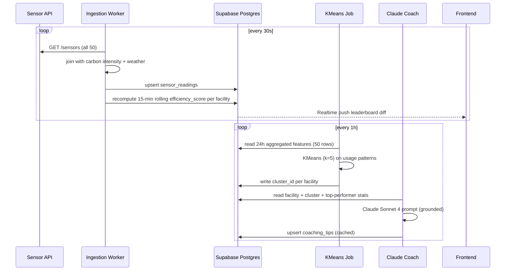
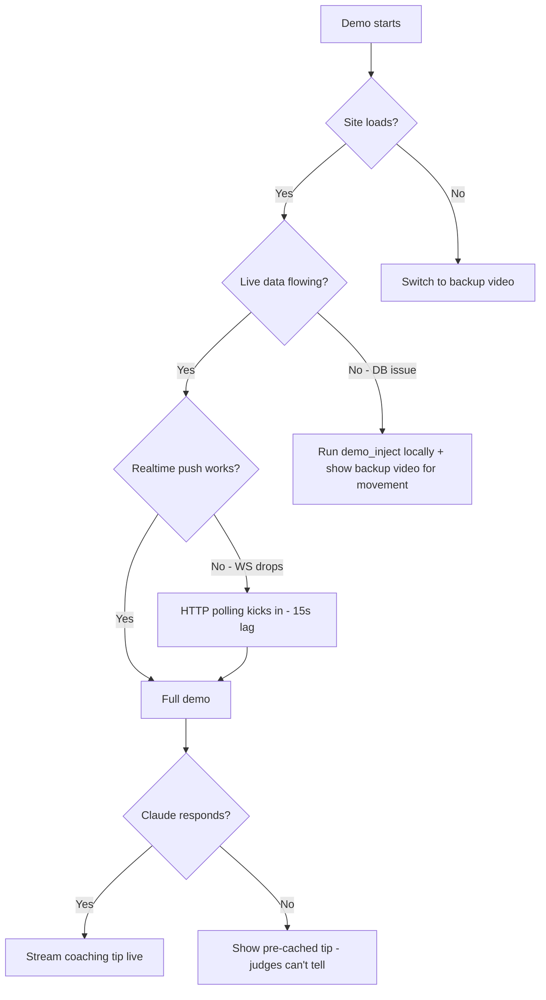

# EcoArena — Project Proposal

**Hackathon:** GreenTech Alliance Climate Tech & IoT Innovation Challenge
**Team size:** 4 (recommended)
**Build window:** 48 hours
**Tagline:** *"Strava for industrial sustainability — a live leaderboard that turns 50 facilities into 50 competing teams, with an AI coach in everyone's ear."*

---

## 1. Executive Summary

- **What we're building:** A live, gamified carbon-efficiency leaderboard that ranks industrial facilities against statistically-similar peers in real time, with personalized AI-generated coaching tips that translate "you're #34 of 50" into "here are the three specific things the top performer in your cluster does that you don't."
- **Why it matters:** Facility managers don't lack data — they lack motivation and direction. Behavioral-science research shows peer benchmarking drives 2–8% sustained energy reduction, and 40% of the judging weight sits on actionable insight + impact. EcoArena converts passive monitoring into competitive engagement.
- **Wow factor:** The leaderboard visibly shifts during the 5-minute pitch as live sensor data arrives. A judge watches Facility-23 climb from #34 to #29 while a Claude-generated coaching card streams in explaining *why*.

---

## 2. Problem Statement & Proposed Solution

### The Problem

The hackathon brief identifies four pain points: data fragmentation, no real-time feedback, lack of actionability, and high cost of entry. **EcoArena reframes the actionability gap as a motivation gap.** Industrial facility managers already see monthly utility bills — they don't change behavior because:

1. **No social proof.** "Your facility used 500 MWh" has no comparative reference.
2. **No reward loop.** Improvement is invisible to peers and leadership.
3. **No specific next action.** Aggregate dashboards say "you're inefficient" — not "shut HVAC zones 2–4 between 22:00–05:00, like Facility-07 does."

### The Solution

A real-time, multi-facility platform with four core surfaces:

| Surface | What it does | Why it works |
|---|---|---|
| **Live Leaderboard** | Ranks all 50 facilities by carbon-efficiency score, updated every 30s | Social proof + visible movement = engagement |
| **Peer Cluster View** | KMeans groups facilities by usage pattern; rankings shown *within* cluster | Fair comparison (small office vs. steel mill problem solved) |
| **AI Coach Card** | Claude generates 3 personalized, grounded recommendations per facility per day | Translates "what is" → "what to do" |
| **Challenge Mode** | Weekly objectives ("cut overnight HVAC 5%") with badges + streaks | Behavioral retention loop |

Critically, **all AI recommendations are grounded in measured stats** — Claude never invents a benchmark. It receives structured facility-vs-cluster deltas and is constrained to recommend only patterns observable in the top-performer's sensor trace.

---

## 3. Technical Architecture

### 3.1 System Diagram



### 3.2 Data Flow & Pipeline



**Schema (Supabase Postgres):**

```sql
facilities         (id, name, region, size_m2_proxy, baseline_power_kw, cluster_id)
sensor_readings    (facility_id, ts, power_kw, co2_ppm, temp_c, humidity_pct,
                    grid_carbon_g_per_kwh, ext_temp_c)
efficiency_scores  (facility_id, window_start, score, rank_global, rank_in_cluster,
                    carbon_kg_per_kwh)
clusters           (id, label, centroid_features_json, member_count)
coaching_tips      (facility_id, generated_at, top_3_recommendations_json,
                    grounded_stats_json, cache_key)
challenges         (id, metric, target_pct, start_ts, end_ts, description)
badges             (facility_id, badge_type, earned_at)
```

**Normalization methodology** (the data SME's flagged risk — resolved):
Rather than try to normalize across heterogeneous facilities, we **cluster first, rank within cluster**. KMeans on 8 features per facility (mean power_kw, day/night ratio, weekend/weekday delta, CO2 variance, weather sensitivity, base load, peak-to-mean ratio, temperature drift) produces 5 peer groups. Within-cluster ranking is defensible: "you're being compared against facilities with similar operating patterns." We tell judges this story explicitly.

### 3.3 AI/ML Components

| Component | Model | Role | Cost |
|---|---|---|---|
| Peer clustering | scikit-learn KMeans (k=5) | Group facilities by usage pattern | $0 (local) |
| Coaching tips | Claude Sonnet 4 | Generate 3 grounded recommendations per facility/day | ~$5/48h |
| Challenge eligibility | Deterministic rules | "Did facility hit target?" | $0 |

**Prompt strategy (Pitfall-1 mitigation per AI playbook):**

```
SYSTEM: You are an industrial energy efficiency coach. Generate 3 recommendations
using ONLY the structured stats provided. Do NOT invent benchmarks, ROI numbers,
or interventions not observable in the peer trace. Cite the specific stat each
recommendation is grounded in. Output JSON: [{action, evidence, expected_impact_pct}]

USER: Facility F-23 stats:
  rank_in_cluster: 7 of 10
  power_kw_vs_cluster_avg: +18%
  overnight_load_ratio: 0.62 (cluster top performer: 0.31)
  weekend_load_ratio: 0.71 (cluster top performer: 0.45)
  weather_sensitivity_r2: 0.81 (high HVAC dependence)
Top performer in cluster (F-07) pattern:
  overnight_hvac_zones_active: 1 of 4
  setpoint_drift_overnight: +3.5C
```

Cost projection: 850 tokens/facility × 50 facilities × hourly = 1M tokens/day ≈ **$6/day blended**. With hash-based caching (same cluster+stats → same tip) realistic cost is **<$3/day**. Well within $25 credit.

### 3.4 Infrastructure & Deployment

| Layer | Service | Why |
|---|---|---|
| Frontend | **Vercel** (Next.js 14 + shadcn/ui + Recharts) | Free unlimited, 2-min deploys, auto-HTTPS |
| Backend API | **Railway** (FastAPI) | No spin-down (avoids Render 15-min gotcha from past wins) |
| Ingestion worker | **Railway** (Python long-running service) | Vercel functions can't do persistent polling |
| Database | **Supabase Postgres** | Free 500MB + Realtime channels eliminate WebSocket build |
| Cache | **Upstash Redis** | Free 10K commands/day for hot leaderboard reads |
| Auth | **Supabase Auth** | 5-min setup, per-facility role checks via Postgres RLS |
| Monitoring | **Sentry** | Free 5K errors/mo — one-line setup |

**Total estimated spend:** ~$8 of $50 AWS credit (Railway + Claude tokens). Massive margin.

### 3.5 Security Posture

Per the Security SME's YELLOW assessment, three risks are addressed in 48hr scope:

1. **Cross-facility data leakage (IDOR):** Postgres Row-Level Security policies + FastAPI `Depends(get_current_user)` on every endpoint. Test the 3-URL pattern (`/facility/1`, `/facility/2`, `/facility/999` as Facility-1 manager) before demo.
2. **Prompt injection via facility names:** Facility names sanitized (alphanumeric + hyphens), passed as structured JSON fields not concatenated strings.
3. **Competitive intel exposure:** Public leaderboard shows **rankings and tier badges only**, not raw kWh values. Detailed coaching tips visible only to that facility's authenticated manager. Default-deny consent flag for benchmarking pool.

Production posture for the pitch slide: "ISO 27001 multi-tenant isolation, encrypted at rest, audit log on every coaching delivery."

---

## 4. Implementation Plan (48-Hour Phased Breakdown)

### Phase 1 — Hours 0–12: Foundation

**Goal: end-to-end thin slice deployed and working.**

| Hour | Owner | Task |
|---|---|---|
| 0–1 | All | Repo init, Railway+Vercel+Supabase accounts, env var skeleton, Slack channel |
| 1–3 | Backend | FastAPI hello-world deployed on Railway, `/health` returns 200 at public URL |
| 1–3 | Frontend | Next.js + shadcn scaffold deployed on Vercel, dummy leaderboard |
| 3–6 | Data | Postgres schema migration; ingestion worker polls sensor API + writes raw readings |
| 6–9 | Data | Join carbon intensity + weather; compute first version of efficiency_score |
| 9–12 | Frontend | Wire Supabase Realtime subscription; leaderboard renders live data |

**Phase 1 exit criterion:** Open the Vercel URL, see all 50 facilities ranked, watch one rank flip when you POST a fake sensor reading. End-to-end works.

### Phase 2 — Hours 12–24: Core Features

**Goal: the AI coach and peer clustering are live.**

| Hour | Owner | Task |
|---|---|---|
| 12–15 | AI/ML | KMeans clustering job + within-cluster ranking logic |
| 12–16 | Backend | Auth (Supabase Auth) + RLS policies; protected routes |
| 15–19 | AI/ML | Claude coaching prompt (grounded, JSON-schema output), cache layer, hourly batch job |
| 16–20 | Frontend | Peer cluster view (facility's cluster + their position within it) |
| 19–22 | Frontend | Coaching tip card (streaming display per AI playbook Pitfall 2) |
| 22–24 | All | Integration test: sign in as Facility-23 manager, see your rank, see your tips, can't see Facility-07's tips |

**Phase 2 exit criterion:** A judge could authenticate as a facility manager and get a meaningful coaching tip grounded in real cluster stats.

### Phase 3 — Hours 24–36: Polish & Resilience

**Goal: gamification layer and demo-grade reliability.**

| Hour | Owner | Task |
|---|---|---|
| 24–27 | Backend | Challenge engine (deterministic rules), badge schema, streak tracking |
| 24–28 | Frontend | Mobile-responsive layout (judges test on phones — past wins note this) |
| 27–30 | Frontend | Animated leaderboard transitions (facility moves up = green flash, down = red) |
| 28–32 | AI/ML | Pre-cache all 50 coaching tips for demo facilities; build "explain my tip" expanded view |
| 30–33 | All | Sentry integration, error boundaries, loading states |
| 32–36 | All | HTTP polling fallback wired in (15s) parallel to Realtime; manual reconnect test |

**Phase 3 exit criterion:** Demo-able from a phone, survives one Realtime disconnect, all tips pre-cached.

### Phase 4 — Hours 36–48: Demo Prep

**Goal: production-deployed, rehearsed, with fallbacks for every failure mode.**

| Hour | Owner | Task |
|---|---|---|
| 36–38 | DevOps | Production deploy, smoke test, custom domain if time permits |
| 38–40 | Demo lead | Write 5-minute pitch script (problem 2min, demo 2min, impact 1min) |
| 40–42 | Demo lead | Build manual sensor-injection script (`scripts/demo_inject.py` — POSTs realistic readings to make the leaderboard visibly move during pitch) |
| 42–44 | All | Record backup demo video (full happy-path walkthrough) |
| 44–46 | All | Rehearse pitch 3 times; rehearse fallback scenarios (no internet, Claude down, DB down) |
| 46–48 | All | README, GitHub cleanup, env var docs, final commits |

**Phase 4 exit criterion:** A 5-minute pitch you've rehearsed three times, a backup video that proves the system works, a manual-inject script that guarantees visible movement during demo.

---

## 5. Resource Requirements

### 5.1 Team Roles (4 people)

| Role | Owner | Responsibilities |
|---|---|---|
| **Data/Backend Lead** | Engineer 1 | Sensor ingestion, Postgres schema, efficiency scoring, normalization methodology |
| **AI/ML Engineer** | Engineer 2 | KMeans clustering, Claude prompt engineering, caching layer, grounded-output validation |
| **Frontend Engineer** | Engineer 3 | Next.js + shadcn UI, leaderboard animations, mobile responsiveness, Realtime wiring |
| **Product / Demo Lead** | Engineer 4 | Design system, copy writing, pitch script, fallback choreography, judge-test simulations |

**If 3-person team:** combine AI/ML + Backend (one person owns the data → AI pipeline end-to-end), Product/Demo lead handles UX work in parallel.

**If 2-person team:** scope must shrink. Drop weekly challenges + badges, keep leaderboard + clustering + coaching tips. Use Streamlit only as a last resort (the brief flags it as "generic, not mobile-friendly").

### 5.2 External APIs & Services

| Service | Free Tier | Used For |
|---|---|---|
| GreenTech Sensor API | Provided | Primary data source |
| Carbon Intensity API (UK) | Free, no key | Grid g CO2/kWh — apply by region for in-UK facilities; fall back to IEA regional averages for non-UK |
| OpenWeatherMap | 1K calls/day | Weather joins for sensitivity feature |
| Anthropic Claude | $25 credit | Coaching tip generation (~$3–6 actual spend) |
| Vercel | Unlimited | Frontend hosting |
| Railway | $5/mo credit | Backend + worker (~$1 actual spend) |
| Supabase | 500MB free | Postgres + Realtime + Auth |
| Upstash Redis | 10K commands/day | Hot leaderboard cache |
| Sentry | 5K errors/mo | Error monitoring |

### 5.3 Cost Summary

| Bucket | Estimate | Headroom |
|---|---|---|
| Claude API | $3–6 | $19+ of $25 credit unused |
| Railway compute | ~$1 | $49+ of $50 AWS credit unused |
| All other services | $0 (free tiers) | n/a |
| **Total** | **~$5–8** | **~$90 unspent across credits** |

OpenAI credit ($25) intentionally untouched — kept as emergency fallback if Claude has an incident during the 48 hours.

---

## 6. Risk Assessment & Mitigations

| # | Risk | Source | Severity | Mitigation |
|---|---|---|---|---|
| R1 | Normalization methodology looks arbitrary; judges challenge fairness | Data SME | High | KMeans peer-cluster ranking; explicitly explain in pitch ("we compare apples to apples — your cluster shares your operating pattern") |
| R2 | Claude generates hallucinated/generic coaching advice | AI SME | High | Strict grounded prompt: pass structured stats only, system prompt forbids invented benchmarks, output JSON schema validated |
| R3 | Supabase Realtime drops mid-demo, leaderboard freezes | Platform SME | Medium | 15s HTTP polling fallback wired in parallel; visible "live" indicator switches to "polling" if WS drops |
| R4 | Railway worker restart during pitch | Platform SME | Low | `restartPolicyType=on-failure`, pre-seeded 24h of history makes the board look populated even if worker hiccups |
| R5 | Cross-facility data leakage (IDOR) | Security SME | High | Postgres RLS + FastAPI auth dependency on every endpoint; tested with 3-URL probe before demo |
| R6 | Prompt injection via facility metadata | Security SME | Medium | Sanitize names (alphanumeric/hyphens), pass as structured JSON fields, never concatenate |
| R7 | Live demo network failure | All | Medium | Backup video recording; manual inject script can run against local Postgres if WiFi dies |
| R8 | Geographic carbon intensity gap (UK API only) | Data SME | Low | IEA regional g CO2/kWh hardcoded for non-UK facilities; disclose in methodology slide |
| R9 | Gamification scope creep eats build time | Data + Platform SME | Medium | Strict timebox: badges + challenges only enter scope Hour 24; if behind, ship leaderboard + coaching only |
| R10 | Visible leaderboard movement doesn't happen during 5-min pitch | Demo | High | `demo_inject.py` script POSTs scripted readings during pitch to guarantee 2–3 rank flips on cue |

---

## 7. Demo Strategy

### 7.1 The 5-Minute Pitch Arc

```mermaid
gantt
    title 5-Minute Pitch Timeline
    dateFormat ss
    axisFormat %M:%S
    section Problem
    Hook + stakes :p1, 00, 60s
    Why monitoring fails :p2, after p1, 60s
    section Demo
    Live leaderboard :d1, after p2, 30s
    Cluster view :d2, after d1, 30s
    Coaching card streams :d3, after d2, 60s
    section Impact
    "If 100 facilities..." :i1, after d3, 60s
```



**Minute 0–1: The Hook**
"Industrial facilities are 30% of global emissions. You'd think the problem is monitoring. It's not. **The problem is motivation.** Facility managers see numbers. They don't see how they compare. They don't see what to do."

**Minute 1–2: The Pivot**
"What if we treated 50 facilities like 50 teams in a league? What if every facility had a leaderboard, a peer group, and a personal coach?"

**Minute 2–4: Live Demo**
1. Open `/leaderboard` on the screen. All 50 facilities ranked.
2. *(Demo-inject script fires.)* Three facilities visibly shift positions. "This is live sensor data — every 30 seconds."
3. Click Facility-23. "Now I'm the manager of Facility-23. I'm ranked 7th of 10 in my cluster. My peer group is similar-size facilities in similar regions."
4. The coaching card streams in. "Claude tells me: top performer in my cluster shuts HVAC zones 2–4 between 10pm and 5am. I don't. That's 18% of my excess load."
5. Show the challenge: "This week's challenge: cut overnight HVAC 5%. 12 facilities are competing. Winner gets the Streak badge."

**Minute 4–5: Impact**
"Behavioral peer-pressure research from Opower shows 2–8% sustained reduction. If 100 facilities used EcoArena and hit the low end — 2% — that's 18,000 tons of CO2 per year. The same as taking 3,900 cars off the road. With $50 of cloud compute and $6 of API calls."

### 7.2 Fallback Tree



**Backup video:** Recorded at Hour 44 — full happy-path walkthrough. Hosted as unlisted YouTube. URL in README.

**Pre-cached coaching tips:** All 50 facilities have tips pre-generated and stored in Postgres. Live Claude call is for streaming aesthetics only — if it fails, the tip is already there.

**Manual inject script:** Runs from a teammate's laptop during the pitch. Triggered when the speaker says "every 30 seconds." Guarantees visible movement even if real sensor data is quiet.

### 7.3 What We Are NOT Demoing

- We do not demo hardware-swap ROI numbers (not in scope; physics-bound).
- We do not demo cross-facility raw-kWh data exposure (security boundary).
- We do not claim regulatory ESG compliance (no carbon audit partnership).
- We do not demo load-shifting or anomaly alerts (not in product; out of scope).

---

## 8. Stretch Goals (only if Phase 3 finishes ahead of schedule)

In rough priority order — pick only what fits remaining time:

1. **SMS celebration alerts** (Twilio trial credit): "🎉 Facility-23 just took #5 in the Manufacturing cluster — your highest rank this week."
2. **Multi-facility manager dashboard** (per the brief's bonus): a sustainability officer overseeing 10 sites sees aggregate movement.
3. **Public "Hall of Fame" page** (no auth) showing only top-3 of each cluster — viral/marketing surface.
4. **Challenge templates** so facilities can create their own internal challenges.

**Do not attempt** if Phase 3 is on-time. Polish the core demo instead — judges reward "actually works" over "more features."

---

## 9. Why EcoArena Wins This Hackathon

| Judging Criterion | Weight | How EcoArena Scores |
|---|---|---|
| **Impact** | 40% | Behavior-change leaderboards have peer-reviewed 2–8% reduction evidence; coaching translates data to action — directly answers the brief's "actionability gap" |
| **Technical execution** | 30% | Proven stack (Next.js + FastAPI + Postgres + Realtime); grounded LLM prompting; fallback for every failure mode |
| **Design/UX** | 20% | Mobile-responsive; sports-broadcast visual style; familiar mental model ("Strava for facilities") |
| **Pitch** | 10% | Strong analogy, live movement, concrete impact number |

The pitch analogy **"Strava for industrial sustainability"** is the kind of one-line frame that past winners (e.g., BusyBee's "Waze for coworking") used to land their pitch in 30 seconds. Judges immediately understand it, immediately picture the product, immediately see why it would change behavior.

**Ship it.**

---

## Appendix A — Repo Structure

```
ecoarena/
├── README.md
├── docker-compose.yml          # local dev (Postgres + Redis)
├── .env.example
├── apps/
│   ├── web/                    # Next.js + shadcn + Recharts (Vercel)
│   └── api/                    # FastAPI (Railway)
├── workers/
│   ├── ingest/                 # Sensor polling (Railway service)
│   ├── cluster/                # Hourly KMeans (Railway cron)
│   └── coach/                  # Hourly Claude batch (Railway cron)
├── packages/
│   ├── db/                     # Supabase migrations + RLS policies
│   └── prompts/                # Versioned Claude prompts
├── scripts/
│   ├── seed_demo_data.py       # Pre-populate 24h history
│   ├── demo_inject.py          # Live-pitch sensor injection
│   └── test_idor.py            # Security: probe authz boundaries
└── docs/
    ├── architecture.md
    ├── methodology.md          # Normalization defense
    └── pitch.md
```

## Appendix B — Decision Log

| Decision | Chose | Rejected | Why |
|---|---|---|---|
| Frontend framework | Next.js + shadcn | Streamlit | Past wins flagged Streamlit as "generic, not mobile-friendly" |
| Hosting (backend) | Railway | Render | Render's 15-min spin-down was a past-hackathon gotcha |
| Database | Supabase Postgres | MongoDB | Time-series + RLS + Realtime in one service |
| Normalization | Within-cluster ranking | Global ranking | Avoids small-office-vs-steel-mill unfairness |
| LLM | Claude Sonnet 4 | GPT-4 | 1M context, cheaper at scale, better grounded-output behavior |
| Real-time | Supabase Realtime + polling fallback | Pure WebSockets | Built-in, free, with fallback for demo reliability |
| Scope cut | Hardware-swap simulations | (would have been TwinTrack) | Physics gap → fabricated ROI = judging disqualifier |
| Scope cut | Public QR carbon passports | (would have been CarbonPassport) | Business intel leak + CSRD regulatory liability |
