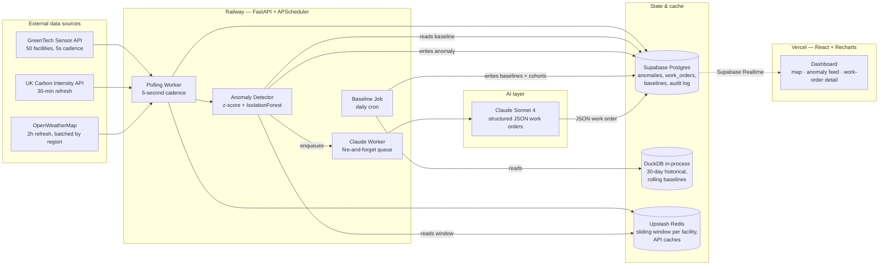

# WattWatch — Project Proposal

**Hackathon:** GreenTech Alliance — Climate Tech & IoT Innovation (48h)
**Submission deadline:** Sunday June 16, 2026 @ 5:00 PM PT
**Team size:** 3 (optimal); works with 2 or 4

---

## 1. Executive Summary

- **What we're building:** WattWatch is an always-on energy-waste detective for industrial facilities. It ingests live IoT sensor streams, learns each facility's normal operating rhythm, flags anomalies in real time, and turns each anomaly into a prioritized, plain-English work order with hard numbers: *"Compressor #7 drawing 28% above peer baseline since June 12 — likely refrigerant leak. Fix saves £1,400/mo and 47 kg CO₂/day."*
- **Why it matters:** Industrial facilities waste 10–30% of their energy on equipment running outside spec — leaky valves, stuck dampers, idle machines, drifting set-points. Today that waste is invisible until a monthly utility bill arrives weeks later. WattWatch closes the loop from sensor reading to actionable maintenance ticket in under 60 seconds — at a $/facility cost an order of magnitude below the $50K enterprise solutions referenced in the brief.
- **Wow factor:** The "anomaly lights up on the live facility map → Claude-generated work order materializes with priced impact" demo moment. Familiar analogy for the pitch: *"Waze for industrial energy waste."*

---

## 2. Problem Statement & Solution

### The problem (from the brief)

Industrial facilities are responsible for ~30% of global carbon emissions but operate with the worst feedback loops in modern industry: data is siloed across HVAC/machinery/utility meters, emissions reports arrive weeks late, raw numbers don't translate to action, and enterprise monitoring solutions cost $50K+.

### Persona

**Maria — Facilities Manager at a 200-employee manufacturing site.** Maria isn't a data scientist. She gets a monthly utility bill, occasionally walks the floor, and trusts her techs to flag breakdowns. She has authority to assign work orders but no time to dig through dashboards. She needs to know *what to fix today, in what order, and what it's worth*.

### Our solution

WattWatch sits between the sensor stream and Maria's morning coffee. It runs three layers continuously:

1. **Behavioural baseline:** Every facility gets its own statistical fingerprint learned from 30 days of history (per-sensor rolling statistics, plus a peer cohort built via clustering on size/region/load profile).
2. **Anomaly detection:** A streaming detector compares the latest reading to the facility's own baseline *and* its peer cohort. A drift that persists beyond a noise threshold becomes an anomaly event.
3. **Actionable work order:** Each anomaly is enriched with grid carbon intensity (UK Carbon Intensity API) and weather (OpenWeatherMap) for context, then handed to Claude Sonnet, which emits a strict-JSON work order: title, likely cause, urgency, recommended action, CO₂ impact, $ impact.

The dashboard surfaces these work orders ranked by impact. Maria opens the app, sees the top three things to fix today, and one-taps "Assign to Tech." That's the whole product loop.

### Why this wins on Impact (40% of judging)

- **Measurable carbon reduction:** Every flagged anomaly carries a kg-CO₂/day estimate computed from real grid intensity. We can roll those numbers into a credible "if 100 facilities used this for a year" projection for the pitch.
- **Actionable:** The output is a work order, not a chart. That's the rubric's exact ask.
- **Scalable:** Detection cost is O(1) per reading; baseline retraining is sub-second per facility. The platform genuinely handles 1,000 facilities on the demo stack.
- **Affordable:** Deployment cost per facility is dominated by sensor hardware (which they already have); the WattWatch SaaS layer is ~$10/facility/month at scale vs. $50K up-front for incumbents.

---

## 3. Technical Architecture

### High-level flow



### 3.1 Data flow & pipeline architecture

**Polling & ingestion** — One FastAPI process on Railway runs APScheduler with three cadences:

| Cadence | Job | Notes |
|---|---|---|
| 5s | Hit `/sensors` for all 50 facilities, append to Postgres `readings`, push to Redis sliding window | One async batch call, not 50 individual polls |
| 30 min | Hit UK Carbon Intensity API per unique region, cache in Redis (TTL 35 min) | ~3 calls/30min — well under 100 req/hr cap |
| 2 hr | Hit OpenWeatherMap per **unique region** (not per facility) — keeps us under the 1K/day free tier | 10 regions × 12/day = 120 calls/day |

**Why batched-by-region weather:** Naive per-facility polling = 50 × 12 = 600 calls/day; tolerable, but the Data SME flagged that mis-cadenced polling can blow the 1K/day limit. We batch by `region` field — facilities at the same lat/lon grid cell share weather.

**Why DuckDB + Supabase split:** Supabase Postgres (500MB free tier) is the operational store — small tables that the frontend reads. DuckDB runs in-process inside the FastAPI worker for the heavy historical analytics (30 days × 50 facilities = ~26M raw readings, ~350MB columnar). DuckDB's SQL window functions compute rolling baselines in one query — no Pandas loops, no separate analytical DB to deploy.

**Downsampling:** Raw 5-second readings are aggregated to **1-minute buckets (mean + max)** before the detector sees them. Kills sensor noise, cuts storage 12×, makes z-scores statistically meaningful.

### 3.2 AI / ML components

| Component | Tool | Role | Demo risk |
|---|---|---|---|
| Per-sensor anomaly detection | scikit-learn `IsolationForest` + rolling z-score (both signals must agree) | Flag readings that deviate from the facility's own baseline | LOW — runs locally, no API |
| Peer cohort clustering | `KMeans` with K=4 on (avg_power_kw, region, facility_size) | Group the 50 facilities so we can compare each to its peers | LOW — fits in <1s |
| Impact estimator | Pure arithmetic: `excess_kWh × grid_gCO2_per_kWh × £/kWh` | Convert anomaly magnitude to $ and CO₂ | NONE — deterministic |
| Work-order generator | Claude Sonnet 4 with `tool_choice` forced JSON schema | Turn anomaly + context into a plain-English work order | LOW — schema-locked output, pre-cached for demo facilities |

**Why no custom training:** The Playbook lesson from last year's winners — Prophet (no training) won 1st, custom models lost. IsolationForest needs zero labels. KMeans on 50 points is trivial. We ship in 16 hours instead of 36.

**Claude prompt design** (forced-JSON via tool use):

```python
system = """You are a building energy engineer writing concise anomaly
reports. Output ONLY from the data provided. Never invent values. If a
cause is uncertain, say "Investigation required: most likely X"."""

user = f"""Anomaly at {facility_name} ({size_sqm} m², {region}).
Sensor: {sensor_id} ({metric})
Current: {current_val} | Baseline: {baseline_val} | Peer median: {peer_val}
Duration: {duration_h}h | Outside temp: {temp_c}°C
Grid intensity: {grid_gco2} gCO2/kWh
Estimated excess: {excess_kwh} kWh = {excess_co2_kg} kg CO2 = £{excess_gbp}"""

tools = [{
  "name": "emit_work_order",
  "input_schema": {
    "type": "object",
    "required": ["title", "likely_cause", "urgency", "action",
                 "co2_impact_kg_per_day", "cost_impact_gbp_per_day"],
    "properties": {
      "title": {"type": "string", "maxLength": 80},
      "likely_cause": {"type": "string"},
      "urgency": {"enum": ["immediate", "today", "this_week"]},
      "action": {"type": "string"},
      "co2_impact_kg_per_day": {"type": "number"},
      "cost_impact_gbp_per_day": {"type": "number"}
    }
  }
}]
# tool_choice = {"type": "tool", "name": "emit_work_order"}
```

Schema-locked output means our UI never has to parse free-form text — it always gets a valid object or an explicit error.

### 3.3 Infrastructure & deployment

**Stack — locked by Hour 1, no debate:**

| Layer | Choice | Why |
|---|---|---|
| Frontend | React + Recharts + Supabase JS client | Vercel deploys in 2 min; Supabase realtime gives live updates with ~10 lines of JS |
| Backend | FastAPI + APScheduler (single process) | One always-on container; APScheduler avoids Celery overhead |
| Hosting (BE) | **Railway** | Always-on. **Never Render or Heroku** — 15-min idle spin-down killed BusyBee at 2025's Future of Work Hack |
| Hosting (FE) | Vercel | Free, fast, HTTPS automatic |
| DB (operational) | Supabase Postgres | 500MB free, built-in realtime, REST auto-generated |
| Analytics | DuckDB in-process | No deploy, SQL window functions, scales to 1000+ facilities |
| Cache | Upstash Redis | Sliding window + API response cache; 10K cmd/day free tier sufficient |
| LLM | Claude Sonnet 4 (forced JSON) | Better writing than Haiku per past-winner note; Haiku for dev iteration to save credits |

**Single most-important platform decision:** Railway, not Render. Render's free-tier spin-down kills any always-on poller. Confirmed by Platform SME.

### 3.4 Security posture & mitigations

Security SME ranked WattWatch as **medium risk with ~3h of achievable mitigations**. Five concrete items, all in the 48-hour budget:

| # | Risk | Mitigation | Owner | Effort |
|---|---|---|---|---|
| 1 | API keys leaked in GitHub | All keys in `.env`, `.env` in `.gitignore`, run `git log --all -p -S "sk-"` at Hour 1 to verify clean history | Person B | 15 min |
| 2 | Cross-facility data leakage (IDOR) | Every query filters by `facility_id` from authenticated session, not from URL/body. Add a single FastAPI dependency `current_facility()` and use it everywhere | Person A | 45 min |
| 3 | Prompt injection via sensor metadata | Claude only sees **structured** numeric inputs — no free-form user text reaches the LLM in v1. Equipment "notes" field is server-side text-only, not passed to Claude | Person B | built-in by design |
| 4 | Claude credit exhaustion via abuse | Rate-limit `/anomalies` endpoint to 10 req/min/IP using `slowapi`; throttle Claude calls to max 1 per (facility, sensor) per 10-min bucket | Person A | 30 min |
| 5 | Work orders auto-sent without review | Work orders display as "Assign to Tech" buttons — never auto-emailed/SMS'd. Disclaimer footer: "Advisory — verify before action" | Person C | 15 min |

**Pitch talking point** when judges ask about data privacy: *"Energy fingerprints are competitively sensitive. Each facility's data is isolated by row-level security in Postgres, never reaches the LLM as free-form text, and our Claude prompts are designed so injected instructions can't override our backend authorization checks."*

---

## 4. Implementation Plan (48-hour phased breakdown)

### Phase 1 — Hours 0–12 (Friday 5 PM → Saturday 5 AM)

**Goal: deployed skeleton with live data flowing into Postgres.**

| Hour | Task | Owner |
|---|---|---|
| 0–1 | **API reconnaissance** — call `/sensors`, `/sensors/historical`, Carbon Intensity, OpenWeather. Confirm actual schemas, row counts, rate-limit reality. *(Per Data SME: this 20-min check eliminates the top failure mode of Hour 36 surprise.)* | All |
| 0–1 | Repo created, `.gitignore` configured, `.env.example` written, GitHub repo audit for keys | B |
| 1–3 | Vercel + Railway + Supabase + Upstash accounts up. "Hello World" deployed end-to-end. **No feature work until this is green.** | A + C |
| 3–6 | Polling worker: 5s sensor fetch + write to Postgres + Redis sliding window | A |
| 3–6 | React dashboard skeleton: facility list, single facility detail page, Recharts time-series of `power_kw` | C |
| 6–9 | DuckDB historical bootstrap: pull 30 days for all 50 facilities (async parallel via `httpx.AsyncClient`), compute per-sensor baselines (mean/std, rolling 1h/24h) | A |
| 6–9 | Claude API integration: write the `emit_work_order` tool schema, mock with hand-crafted test anomaly, validate strict JSON output | B |
| 9–12 | Anomaly detector v1: rolling z-score on 1-min downsampled power_kw, threshold > 3σ + persistence > 5 min, write event to `anomalies` table | A |
| 9–12 | Supabase realtime subscription wired into React; anomalies appear live without refresh | C |

**Phase 1 exit criterion:** A real anomaly written to Postgres at Hour 11 appears on the React dashboard at Hour 11 + 1 second. Map can wait. Beauty can wait. **Closing the loop end-to-end is the only Phase 1 goal.**

### Phase 2 — Hours 12–24 (Saturday 5 AM → Saturday 5 PM)

**Goal: the demo product is functionally complete.**

| Hour | Task | Owner |
|---|---|---|
| 12–14 | IsolationForest layer added — both z-score and IsolationForest must agree before an event fires (cuts false-positive rate) | A |
| 12–15 | KMeans peer cohort clustering; baseline includes peer-median comparison | A |
| 14–18 | Claude work-order generation triggered on each anomaly; cached in `anomalies.work_order_json` so re-renders are free | B |
| 15–20 | Facility map view: SVG/Leaflet with 50 facility pins; pins pulse red on active anomaly (driven by Supabase realtime) | C |
| 18–22 | Work-order detail panel: cost impact, CO₂ impact, suggested action, "Assign to Tech" stub button (writes audit row) | B + C |
| 20–24 | Impact projection page: "If 100 facilities ran WattWatch for a year, we'd save X tons CO₂" — pre-computed from observed anomalies | B |

**Phase 2 exit criterion (Saturday 5 PM):** Saturday-evening IoT mentor office hours arrive. Show them a real anomaly flowing end-to-end. **If anything is broken, stop and fix before sleep.**

### Phase 3 — Hours 24–36 (Saturday 5 PM → Sunday 5 AM)

**Goal: tighten the demo, kill false positives, make it mobile-friendly.**

| Hour | Task | Owner |
|---|---|---|
| 24–28 | **False-positive purge** — run detector over 30 days of historical data, inspect every flagged event, tune contamination + magnitude thresholds. *Critical: a demo with 100 noise flags loses on UX score.* | A |
| 24–28 | Pre-generate Claude work orders for the top 5 most visually striking anomalies; cache aggressively | B |
| 28–32 | Mobile responsive pass on dashboard (Recharts has good mobile defaults; Tailwind breakpoints for layout) | C |
| 28–32 | Loading skeletons, empty states, error boundaries on every API call (graceful degradation per rubric) | C |
| 32–34 | **Sleep cutoff at midnight per past-winner discipline** — bad demos come from sleep-deprived teams | All |
| 34–36 | Wake-up smoke test: full dashboard loads in <2s, anomaly appears live, work order detail renders | All |

### Phase 4 — Hours 36–48 (Sunday 5 AM → 5 PM submission)

**Goal: bulletproof the demo and rehearse.**

| Hour | Task | Owner |
|---|---|---|
| 36–38 | **Seed 3 hero anomalies directly in Supabase**, each with hand-crafted Claude work orders. *These are our guaranteed demo path.* | A |
| 36–38 | Record backup demo video (Loom/QuickTime) — full 2-min walkthrough that plays if anything breaks live | C |
| 38–40 | `DEMO_MODE` env flag: when on, polling worker replays a scripted anomaly every 90s so judges always see a fresh "live" event | A |
| 38–41 | README polish: what it does, how to run it, tech stack, team. **Architecture diagram pasted from this proposal.** | B |
| 40–42 | Pitch deck: 6 slides max — problem, persona, solution, live demo, impact projection, ask | All |
| 41–43 | Climate advisor office hours (Sunday 10 AM–12 PM): get expert sanity-check on impact projection numbers | B |
| 42–46 | **Three full pitch rehearsals.** Time them. Cut anything that doesn't earn its 30 seconds. | All |
| 46–48 | **Code freeze at 2 PM PT.** No commits after this. Final deploy. Walk away. | All |

---

## 5. Resource Requirements

### Team roles (3 people)

| Role | Person | Owns |
|---|---|---|
| **Data & Backend Lead** | A | Polling worker, DuckDB baselines, anomaly detector, Postgres schema, Railway deploy, demo-mode replay |
| **AI & API Integration** | B | Claude integration, work-order JSON schema, impact projection math, security mitigations, README |
| **Frontend & Pitch Lead** | C | React dashboard, facility map, mobile responsiveness, backup video, pitch deck, demo narration |

**If you only have 2 people:** A takes data + backend + AI integration; C takes frontend + pitch. Drop the facility map (use a simple table). Keep everything else.

**If you have 4 people:** Person D pairs with C on UX polish (mobile, animations, loading states) — UX is 20% of the score.

### External APIs & services

| Service | Tier | Purpose |
|---|---|---|
| GreenTech Sensor API | Provided bearer token | Live sensor stream |
| UK Carbon Intensity API | Free, 100 req/hr | Grid carbon factor for impact math |
| OpenWeatherMap | Free, 1K calls/day | Weather context for Claude prompt |
| Anthropic Claude Sonnet 4 | $25 credit provided | Work-order generation |
| Supabase | Free 500MB | Operational DB + realtime |
| Upstash Redis | Free 10K cmd/day | Sliding window + API cache |
| Railway | $5/mo credit | FastAPI backend hosting |
| Vercel | Free unlimited | React frontend hosting |

### Estimated cloud spend

| Service | Expected weekend cost | Headroom |
|---|---|---|
| Railway | $1–2 | $3 left in monthly credit |
| Claude (Sonnet, ~750 work orders incl. dev iteration) | $4–8 | $17 left of $25 |
| OpenAI | $0 (unused) | $25 unused — emergency budget |
| Vercel | $0 | unlimited |
| Supabase | $0 | unlimited |
| Upstash | $0 | unlimited |
| **TOTAL** | **~$5–10** | **~$90 unused** |

**Cost guardrails:** (1) Use Claude Haiku for all dev/test iterations — 12× cheaper than Sonnet. Swap to Sonnet only for final demo path. (2) Throttle Claude calls to max 1 per (facility, sensor) per 10-min window. (3) Set Anthropic billing alert at $15.

---

## 6. Risk Assessment & Mitigations

Synthesizing the specialist inputs into a prioritized risk register.

| # | Risk | Likelihood | Impact | Mitigation | Owner | Drawn from |
|---|---|---|---|---|---|---|
| 1 | **API key leaked in public GitHub repo** — burns $25 credit, blocks demo | Medium | Critical | `.env` + `.gitignore` from commit #1; Hour-1 audit with `git log --all -p -S "sk-"`; rotate keys if found | B | Security SME |
| 2 | **Cross-facility data leakage** — IDOR via missing `facility_id` filter | Medium | Critical | Single `current_facility()` FastAPI dependency; mandatory in every query; test with two simulated facility tokens | A | Security SME |
| 3 | **False-positive flood** — judges see a noise machine, not a detective | High | High | Two-signal agreement (z-score AND IsolationForest); magnitude floor (>15% above baseline); persistence floor (>5 min); manual purge in Phase 3 | A | AI + Data SMEs |
| 4 | **Railway backend dies during judging** | Low | Critical | Supabase realtime keeps last-state on screen even if backend is down; 3 pre-seeded hero anomalies; backup video; `DEMO_MODE` flag | A | Platform SME |
| 5 | **Claude API latency or 429 during demo** | Low | Medium | All work orders cached in Postgres after first generation; fallback display shows raw anomaly fields with "narrative pending" badge | B | AI SME |
| 6 | **OpenWeatherMap 1K/day quota breach** | Low | Medium | Batch by region (10 calls/cycle, not 50); 2h cadence; Redis cache TTL 2h | A | Data SME |
| 7 | **Claude burns through $25 credit in dev iteration** | Medium | Medium | All dev/test on Haiku ($0.25/$1.25 vs Sonnet $3/$15); switch to Sonnet only Sunday morning | B | AI SME |
| 8 | **Scope creep — team starts building a chatbot or predictive maintenance** | High | High | Lead engineer (you) blocks all scope changes after Hour 12. Bonus challenges (SMS alerts, ROI calc) stay deferred until Phase 4 has slack | All | Past-winner lessons |
| 9 | **Anomaly detection wrong on synthetic data** (too clean) | Medium | Medium | Tune contamination parameter against the historical endpoint in Hour 6; calibrate against known weekend ramp-downs | A | AI SME |
| 10 | **Pitch ends up technical, not visceral** | Medium | High | Open with Maria the facility manager, not the architecture diagram; 3 full rehearsals in Phase 4; cut anything that doesn't help judges feel the problem | C | Past-winner key insights |

---

## 7. Demo Strategy

### 5-minute pitch structure

| Time | Slide / Action | What it accomplishes |
|---|---|---|
| 0:00–0:30 | **Hook** — "Imagine your factory is leaving its lights on, but only between 2 and 4 AM, and only on weekends, and only on the third floor. How would you know?" | Make judges feel the problem |
| 0:30–1:30 | **Problem + persona** — Maria the facility manager. Monthly bills, weeks-late data, $50K monitoring solutions she can't afford | Ground the impact (40%) |
| 1:30–2:00 | **Solution one-liner + analogy** — *"WattWatch is Waze for industrial energy waste. Always watching, always re-routing your operations to the cheapest, cleanest path."* | Pitch quality (10%) |
| 2:00–4:00 | **Live demo** — see flow below | Tech (30%) + UX (20%) |
| 4:00–4:30 | **Impact projection** — "If 100 facilities ran WattWatch for one year, we'd flag ~XX tons of CO₂ waste and ~£YY of cost. At our $10/facility/month price, that's a 40× ROI in year one." | Hit Impact dimension hard |
| 4:30–5:00 | **Close + ask** — open-source on GitHub, ready to deploy to your facility today | Confidence |

### Live demo flow (the 2-minute window)

1. **Open dashboard on a phone** (mobile-responsive). Shows facility map with 50 pins. Judge watches three pins pulse green (healthy) → one pin flashes red. *Magic moment #1.*
2. **Tap the red pin.** Anomaly detail page slides up: power consumption chart with the anomaly highlighted, peer cohort comparison, and the Claude-generated work order card. *Magic moment #2 — read the work order verbatim:* "Compressor #7 at Facility 23 drawing 28% above peer cohort since June 12. Likely refrigerant leak in condenser unit. Saving if fixed: £1,400/month, 47 kg CO₂/day. Recommended action: dispatch HVAC tech for leak inspection."
3. **Tap "Assign to Tech."** Toast notification. Audit row written. *Magic moment #3 — the loop is closed.*
4. **Back to map.** "This dashboard is updating live. Any anomaly across 50 facilities surfaces here within 60 seconds of the sensor seeing it."

### Fallback plan if the live demo breaks

Three layers of safety net (per Platform + AI SME recommendations):

1. **Layer 1 — `DEMO_MODE` flag:** Polling worker replays a scripted anomaly every 90s. Judges always see a fresh "live" event, even if the upstream sensor API is misbehaving.
2. **Layer 2 — Pre-seeded hero anomalies:** Three hand-crafted anomalies sit in Postgres with pre-generated Claude work orders. If realtime is broken, the dashboard still shows compelling content on first load.
3. **Layer 3 — Backup video:** A 2-minute Loom recording of the full demo, recorded Sunday morning before code freeze. If everything else fails, narrate over the video. *Past-winners did exactly this. Judges expect it.*

### The pitch narrative arc

We're not selling a dashboard. We're selling **Maria getting her Monday morning back.** Every slide should reinforce that she goes from drowning in unreadable data to having three clear actions, each with a price tag and a CO₂ number, on her phone before her first coffee.

If a sentence in the pitch doesn't advance Maria's story, cut it.

---

## 8. Appendix — Decision Log

### Why we did not pick CarbonPilot (Grid-Aware Load Shifter)

Strong impact story (the highest, arguably), but Data Engineering flagged it as borderline-veto in 48 hours: Prophet training on 50 facilities consumes 25–75 minutes wall-clock; the four-source join (sensor × historical × carbon × weather) creates timestamp-alignment bug surface; OpenWeatherMap free tier breaks at naive cadence; and the entire value prop depends on accurate 24h grid forecasts that may not exist for all regions. Three independent failure modes is too many for a hackathon.

### Why we did not pick Carbon Co-Pilot (Conversational Advisor)

Highest wow-ceiling but unanimously last-ranked on demo reliability. AI SME: agentic tool-use is non-deterministic by design, costs 3–6h of debugging time per tool, and a single hallucinated answer on stage destroys credibility. Platform SME: SSE/streaming over Vercel + Railway with stateful chat sessions is a 6–8h infrastructure problem alone. Security SME: free-form chat + tool-use against multi-tenant data = highest IDOR + prompt-injection surface of the three. Net: too many ways to fail in front of judges.

### Decisions locked at Hour 1 (do not relitigate)

1. Railway, not Render. (Spin-down kills polling.)
2. Supabase Postgres + DuckDB split. No MongoDB (past winners migrated away from it for time-series).
3. Claude Sonnet 4 for demo path, Haiku for dev. Forced-JSON via `tool_choice`.
4. Region-batched OpenWeather polling. Never per-facility.
5. Two-signal anomaly detection (z-score AND IsolationForest agree).
6. No auth UI in v1. Single tenant token, scoped at backend dependency layer.
7. No SMS, no email, no chatbot. Work orders stay in-app.
8. Sleep at midnight Saturday. Non-negotiable.

---

**Let's build it. 🌍⚡**
